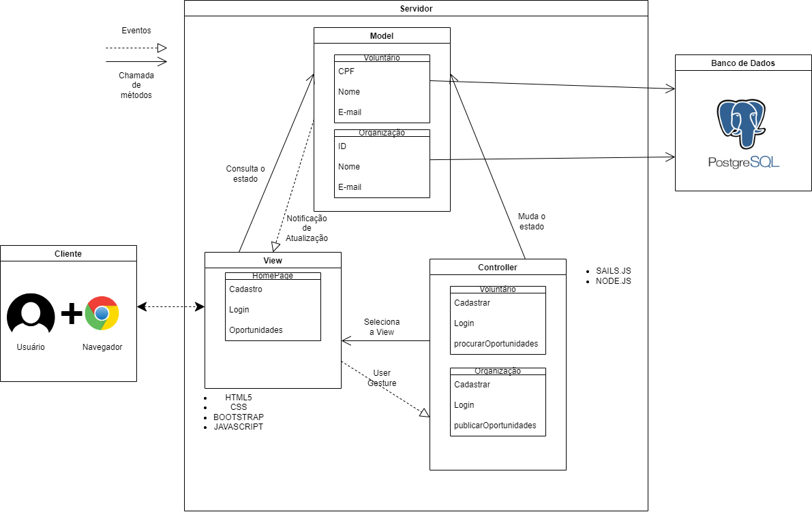

# Arquitetura MVC Sails para organização "Parceiros Voluntários"
&nbsp;&nbsp;&nbsp;&nbsp; O Sails.js é um framework Node.js que segue o padrão de arquitetura MVC (Model-View-Controller) e é projetado para facilitar a criação de aplicativos web e APIs robustas. Assim, com o desenvolvimento de um MVC, um padrão de design amplamente utilizado em desenvolvimento de software, especialmente em aplicações web, somos capazes de compreender como funcionam as partes da nossa aplicação e como elas são interpretadas. Um exemplo claro disso, é o diagrama situado logo abaixo, construído com a ferramenta de diagramação draw.io que consta um modelo MVC de um sistema web responsável em conectar indivíduos que realizam e procuram trabalhos voluntários, com organizações que dispõe dessas oportunidades.  

Figura 1 - Diagrama MVC 
 
Fonte: Material produzido pelo autor (2024)

 

&nbsp;&nbsp;&nbsp;&nbsp; Nesse sentido, tal diagrama possui como objetivo facilitar o processo de desenvolvimento da aplicação, tendo em vista os principais módulos, funcionalidades e recursos que o projeto oferecerá, como os dados dos voluntários e das organizações que o banco de dados coletará, as ações que cada um desses perfis podem realizar na aplicação, além dos setores que serão apresentados para os demais usuários. Dito isso, são muitas as funcionalidades que um sistema web desse nível de complexibilidade possui, porém, no momento atual, iremos focar no essencial de suas funcionalidades.  

&nbsp;&nbsp;&nbsp;&nbsp; Desse modo, realizando a interpretação do diagrama, considerando as três partes que compõem o modelo MVC, inicializando pela View, responsável por apresentar os dados ao usuário de forma visualmente atraente e interativa, através de ferramentas como o HTML5, o CSS, o Javascript e o Bootstrap, o projeto foca na HomePage do sistema, local onde aparecerão setores visuais para interação, como o setor de cadastro, login e o de oportunidades; campos, esses, essenciais para a utilização inicial dos usuários.  

&nbsp;&nbsp;&nbsp;&nbsp; Prosseguindo, a View é conectada com o Controller, responsável por receber as interações do usuário na View, processando e atualizando o Model conforme necessário, a julgar que é o Controller que irá guiar a conexão entre o View e o Model, principalmente no que se refere aos métodos presentes tanto no escopo dos “Voluntários”, como no escopo das “Organizações”. Dessa forma, é graças a aplicação do sails.js e do node.js, que tal interação pode ser realizada, pois os dois públicos podem iniciar as suas ações, definidas pela construção do controller, ,de forma efetiva.  

&nbsp;&nbsp;&nbsp;&nbsp; Por fim, será no Model que tanto a entidade “Voluntários” quanto a entidade “Organização” receberão atributos responsáveis por criar a sua identificação, pois ele é o responsável por acessar e manipular os dados, respondendo a consultas e atualizações vindas da View ou do Controller, representando os dados da aplicação e as regras de negócio relacionadas a esses dados, como o nome e o e-mail, informações presentes nas duas entidades.  

&nbsp;&nbsp;&nbsp;&nbsp; Logo, a arquitetura MVC é essencial em um projeto, pois, além de auxiliar na sua infraestrutura, como no desenvolvimento de um banco de dados para armazenar informações dos usuários e das suas atividades, ou na criação de uma API externa para envio de notificações por e-mail ou mensagens, ele contribui para o entendimento do desenvolvedor sobre a essência da aplicação, deixando mais claro os seus elementos, funcionalidades e objetivos. Portanto, vemos a eficácia dessa ferramenta ao desenvolver esse projeto atual, pois alcança a clareza necessária para fomentar os elementos básicos para a criação de um sistema web de voluntariado, focado nas ações dos voluntários potenciais e nas organizações gestoras de oportunidades.  
